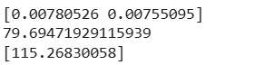

# Implementation of Multivariate Linear Regression
## Aim
To write a python program to implement multivariate linear regression and predict the output.
## Equipment’s required:
1.	Hardware – PCs
2.	Anaconda – Python 3.7 Installation / Moodle-Code Runner
## Algorithm:
### Step1
Import pandas and LinearRegression from sklearn.

### Step2
Read the CSV file and select Volume and Weight as input features (X), and CO2 as the output (y).

### Step3
Initialize a LinearRegression model.


### Step4
Fit the model using the input features (X) and target (y).

### Step5
Print the model’s coefficients, intercept, and predict CO2 for given input values [3300, 1300].

## Program:
```python
import pandas as pd
from sklearn import linear_model
df=pd.read_csv("/content/sample_data/car (1).csv")
x=df[["Volume","Weight"]]
y=df["CO2"]
regression=linear_model.LinearRegression()
regression.fit(x,y)
print(regression.coef_)
print(regression.intercept_)
print(regression.predict([[3300,1300]]))
```
## Output:



## Result
Thus the multivariate linear regression is implemented and predicted the output using python program.